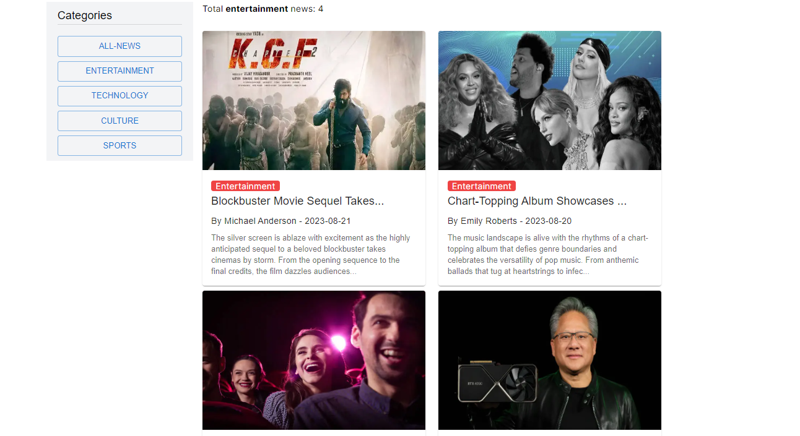

# News Portal Website

## Project Overview

A dynamic news portal website that aggregates news from various sources, categorizes articles, and provides users with a personalized news reading experience.

## Technologies Used

````
```Frontend: Next.js, JavaScript, React.js, HTML, CSS,

```Backend: Node.js, Express.js,

```Database: MongoDB,

```Version Control: Git, GitHub,

```Deployment: Vercel
````

# Images of Site




